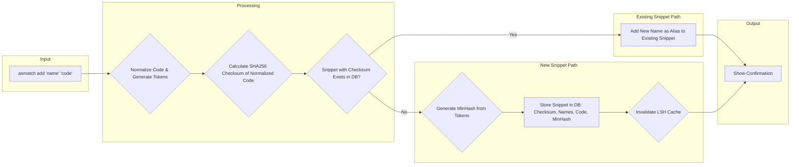
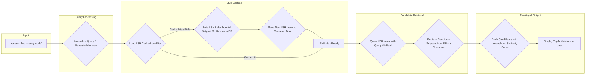
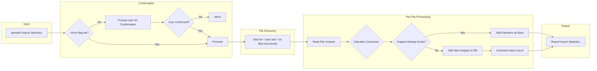
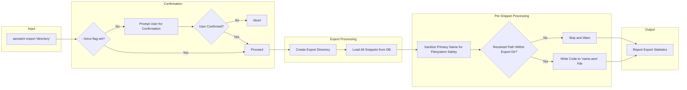

# asmatch Flowcharts

This document contains Mermaid charts illustrating the core workflows of the `asmatch` tool.

## Add Snippet Flow

This chart describes the process of adding a new snippet to the database.

## Find Matches Flow

This chart illustrates the process of finding similar snippets.

## Import Snippets Flow

This chart describes the bulk import process.

## Export Snippets Flow

This chart describes the snippet export process.

